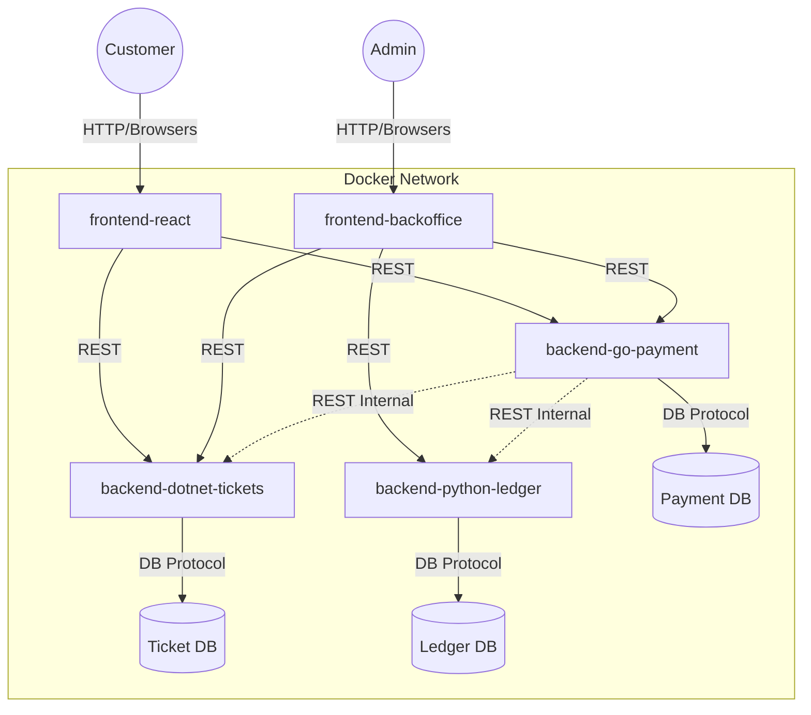

# E-Ticketing Challenge System

Welcome to the E-Ticketing Challenge System! This is a full-stack, polyglot microservices application designed to demonstrate modern software architecture principles, including Clean Architecture, containerization, and automated CI/CD.

## 🏗 Architecture Diagram

The system follows a microservices architecture pattern, where each domain is isolated with its own database and business logic. The services interact over HTTP REST APIs.




## 🧩 Service Responsibilities

| Service | Stack | Port | Description |
| :--- | :--- | :--- | :--- |
| **backend-dotnet-tickets** | .NET 10 (C#) | `5020` | Core domain for Ticket inventory and management. Implements **Clean Architecture**. |
| **backend-go-payment** | Go 1.25 | `8081` | Handles payment processing and gateway integrations (Mock/Stripe). |
| **backend-python-ledger** | Python 3.11 | `8000` | Double-entry accounting ledger to record all financial transactions auditably. |
| **frontend-react** | React 19 | `3000` | Customer-facing application for browsing tickets, cart management, and checkout. |
| **frontend-backoffice** | React 19 | `3001` | Administrative dashboard for viewing sales, inventory, and ledger entries. |

## 🚀 How to Run Locally

### Prerequisites
- Docker & Docker Compose installed
- Git

### Steps
1. **Clone the repository**:
   ```bash
   git clone <repo-url>
   cd eticketing-challenge
   ```

2. **Configure Environment**:
   Create a `.env` file at the root (or verify the existing one):
   ```bash
   PUBLIC_IP=localhost
   # PUBLIC_DOMAIN=localhost (optional)
   
   # These help the frontends find the backends locally
   REACT_APP_API_URL=http://localhost:5020
   PAYMENT_API_URL=http://localhost:8081
   LEDGER_API_URL=http://localhost:8000
   ```

3. **Start the System**:
   ```bash
   docker-compose up -d --build
   ```

4. **Access the Applications**:
   - Customer App: [http://localhost:3000](http://localhost:3000)
   - Backoffice: [http://localhost:3001](http://localhost:3001)
   - Ticket API Swagger: [http://localhost:5020/swagger](http://localhost:5020/swagger)
   - Payment API Docs: [http://localhost:8081/swagger/index.html](http://localhost:8081/swagger/index.html) (if enabled)
   - Ledger API Docs: [http://localhost:8000/docs](http://localhost:8000/docs)

## ☁️ How to Deploy (EC2 / Production)

We use **GitHub Actions** for CI/CD. The deployment pipeline automatically deploys changes to an AWS EC2 instance.

1.  **Provision EC2**: Ubuntu Server.
2.  **Setup Server**: Run keys setup script inside `scripts/setup_ec2.sh`.
3.  **Secrets**: Add `EC2_HOST`, `EC2_USER`, and `EC2_SSH_KEY` to GitHub Repo Secrets.
4.  **Deploy**: Push to `main` branch.

See full guide in: [DEPLOY_EC2.md](./DEPLOY_EC2.md)

## 🔑 Environment Variables

The system relies on a central `.env` on the production server (generated by CI/CD) or locally.

| Variable | Description | Default (Local) |
| :--- | :--- | :--- |
| `PUBLIC_IP` | The public IP of the host/server. | `localhost` |
| `REACT_APP_API_URL` | Base URL for the Ticket Service used by Frontends. | `http://localhost:5020` |
| `TICKET_API_URL` | Internal/External URL for Ticket Service. | `http://localhost:5020` |
| `PAYMENT_API_URL` | Internal/External URL for Payment Service. | `http://localhost:8081` |
| `LEDGER_API_URL` | Internal/External URL for Ledger Service. | `http://localhost:8000` |

## 📡 API Examples

### 1. Get Available Tickets
```bash
curl -X GET "http://localhost:5020/api/v1/tickets" -H "accept: application/json"
```

### 2. Create an Order (Checkout)
```bash
curl -X POST "http://localhost:5020/api/v1/checkout/orders" \
     -H "Content-Type: application/json" \
     -d '{
           "customer_email": "john@example.com",
           "cart_items": [
             { "ticket_id": "gold_001", "quantity": 2 }
           ]
         }'
```

### 3. Process Payment
```bash
curl -X POST "http://localhost:8081/api/v1/payments" \
     -H "Content-Type: application/json" \
     -d '{
           "order_id": "ORD-12345",
           "amount": 200.00,
           "currency": "AED",
           "payment_method": "credit_card"
         }'
```

## ⚖️ Assumptions & Trade-offs

1.  **Shared Database vs Isolated DB**: 
    -   *Decision*: We chose **Isolated Databases** (Database-per-service pattern).
    -   *Trade-off*: Higher complexity in infrastructure (3 Postgres containers), but ensures loose coupling and independent scaling.

2.  **Communication Protocol**:
    -   *Decision*: Synchronous **HTTP/REST**.
    -   *Trade-off*: Easier to implement and debug than event-driven (RabbitMQ/Kafka), but introduces temporal coupling (if Ticket Service is down, Payment might fail to validate inventory).

3.  **Authentication**:
    -   *Assumption*: For this challenge scope, APIs are public or use simple internal checks. A production system would require OAuth2/OIDC (e.g., Auth0 or Keycloak).

4.  **Frontend Configuration**:
    -   *Decision*: Build-time environment variables (`ARG`) in Docker.
    -   *Trade-off*: Requires rebuilding the container to change the API URL. Runtime configuration (fetching `config.json` on startup) would be more flexible but slightly more complex to setup.

5.  **Polyglot Stack**:
    -   *Reason*: To demonstrate proficiency in multiple modern languages (.NET, Go, Python).
    -   *Trade-off*: Increased operational complexity (need meaningful CI pipelines for all 3 stacks).

## 🛠 CI/CD & Code Quality

-   **GitHub Actions**: Pipelines created for all 5 services ([.github/workflows](./.github/workflows)).
-   **SonarQube**: Integration added for static code analysis. See [SONARQUBE_SETUP.md](./SONARQUBE_SETUP.md).

---
*Generated for E-Ticketing Challenge*


[def]: https://ibb.co/h1DGkNGd